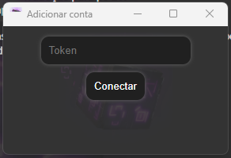

<h1 align="center">Kevin Launcher</h1>

Kevin launcher é um complemento para te auxiliar com o Fortnite, dando a liberdade para efetuar diversas ações sem precisar abrir o jogo.

Possibilidades
=================
<!--ts-->
   * **Iniciar jogo** ⇒ Abre um Fortnite sem precisar estar com o launcher da Epic Games aberto. (É possivel abrir mais de um Fornite, é por sua conta e risco...);
   * **Acesso à conta**
      * **Configurações** ⇒ Abre o seu navegador diretamente na sua tela para mudanças de configurações da conta;
      * **Detalhes** ⇒ Veja os detalhes de sua conta;
   * **Battle Royale**
      * **Lista de amigos** ⇒ Envie pedidos de amizades, veja seus amigos e exclua amigos;
      * **Loja de Itens** ⇒ Veja a loja de itens, compre e envie presentes;
      * **V-Bucks** ⇒ Veja detalhes e a quantidade de V-Bucks na conta;
      * **Vestiario** ⇒ Veja seu vestiário completo;
   * **Salve o Mundo**
      * **Hérois** ⇒ Veja seus hérois do SoM;
      * **Gerenciar Hérois** ⇒ Evolua ou recicle seus hérois do SoM;
      * **Pontos de Pesquisa** ⇒ Veja e evolua seus níveis de pesquisa do SoM;
      * **Nome da Base Inicial** ⇒ Mude o nome da sua base inicial (homebase) do SoM;
      * **Perfil** ⇒ Veja detalhes do seu perfil do SoM (porcentagem p/platinar, níveis, gastos e etc...);
      * **Recursos** ⇒ Veja seus recursos do SoM;
<!--te-->

Como usar
=================

- Clique em **Conta** e em **Adicionar conta**
  * O navegador irá abrir e você deve efetuar o login em sua conta Epic Games, após o login copie o código após "authorizationCode"

```
{
    "redirectUrl": "https://accounts.epicgames.com/fnauth?code=a51c1f4d35b1457c8e34a1f6026faa35",
    "authorizationCode": _"a51c1f4d35b1457c8e34a1f6026faa35"_,
    "sid": null
}
```
<h1 align="right">
  
</h1>
Este launcher é baseado na open source [Potato Launcher](https://github.com/a-bakedpotato/Potato-Launcher). 
<br>Todos os créditos são destinados ao a-bakedpotato.
